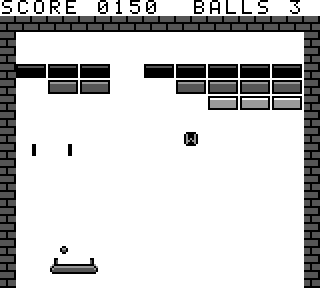
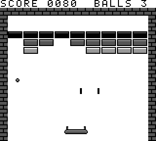
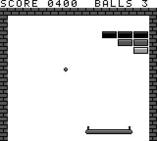

# Breakout for Game Boy / Game Boy Pocket

A classic brick-breaker made for the original monochrome Game Boy (DMG) and the Game Boy Pocket. It uses the system's four shades of gray, is written in C with [GBDK-2020](https://github.com/gbdk-2020/gbdk-2020) and builds into a 32 KB ROM-only cartridge image.

| Title | Gameplay | Laser | Wide paddle |
|:---:|:---:|:---:|:---:|
|  |  |  |  |

> Status: early prototype. It has been tested in the PyBoy emulator but not yet on real hardware.

## Features

- **3 rows of bricks** (9 per row), each row in a different shade of gray, worth 30, 20 or 10 points
- **Realistic ball movement**
  - The ball always travels at the same speed, because every bounce is perfectly elastic
  - Positions use 8.8 fixed-point numbers, with 2 sub-steps per frame
  - X and Y movement are checked separately, so bounces off walls and bricks are true mirror reflections (the ball leaves at the same angle it came in), even at corners, and the ball never passes through a brick
  - The paddle surface is treated as slightly curved. Its surface direction tilts by up to about 10° toward the edges, so a hit near the edge deflects the ball by up to about 20° (outgoing angle = incoming angle + 2 × tilt)
  - **Friction:** the paddle's speed at the moment of impact passes some momentum to the ball
  - The paddle has inertia: it speeds up and slows down instead of moving at a fixed speed
  - The exit angle is capped at about 65°, so the ball never gets stuck moving almost sideways
- **Sound on every hit** using the Game Boy's built-in sound hardware
  - Brick hit: a square-wave tone, pitched by row (channel 1)
  - Paddle hit: a lower, duller tone (channel 2)
  - Also: a soft click on walls, a laser "zap" and a lost-ball noise burst (channel 4), plus pick-up and level-clear sweeps
- **Power-ups** that fall from destroyed bricks (only one on screen at a time)

  | Capsule | Effect | Share of drops |
  |:---:|---|:---:|
  | **L** | Laser: for 3 seconds, press A to fire two beams that destroy bricks (hold A for auto-fire) | 40 % |
  | **W** | Wide: the paddle is twice as wide for 10 seconds | 40 % |
  | **♥** | Extra ball (up to 9) | 20 % |

  The paddle blinks during the last 1.5 seconds of an effect. Losing a ball ends all active effects.
- **Levels with fewer power-ups as you go:** the chance that a brick drops one goes down each level

  | Level | 1 | 2 | 3 | 4 | 5 | 6 | 7 | 8 | 9+ |
  |---|---|---|---|---|---|---|---|---|---|
  | Drop chance | 25 % | 17 % | 12.5 % | 9 % | 7 % | 5.5 % | 4.3 % | 3.5 % | 2.7 % |

- Score, number of balls, pause, game over and level clear screens

## Controls

| Button | Action |
|---|---|
| D-Pad ← → | Move paddle |
| A | Launch ball / fire laser (during the laser power-up) |
| START | Start game, pause / resume, next level |

## Building

Requirements:
- [GBDK-2020](https://github.com/gbdk-2020/gbdk-2020/releases) 4.3.0 (other 4.x versions will probably work too)
- Python 3, only needed to rebuild the graphics

```sh
# Regenerate tile graphics (optional, tiles.h is already included)
python3 gen_tiles.py

# Build the ROM
make GBDK=/path/to/gbdk
# or directly:
/path/to/gbdk/bin/lcc -Wm-yn"BREAKOUT" -o breakout.gb main.c
```

The output is `breakout.gb`. Run it in any Game Boy emulator (SameBoy, Emulicious, mGBA, BGB, PyBoy …) or on real hardware with a flash cartridge.

## Project structure

```
main.c         Game logic: physics, collisions, power-ups, sound, game states
gen_tiles.py   Builds all graphics (font, bricks, walls, sprites) into tiles.h
tiles.h        Generated 2bpp tile data
Makefile       Build script
docs/          Screenshots
```

## Technical notes

- **Video:** background tiles are used for the walls, bricks and text (BGP `0xE4`). Sprites are used for the paddle (3 or 6 sprites), ball, power-up capsule and 2 laser beams. A second, lighter sprite palette (OBP1) makes the paddle blink.
- **Bricks** are 16×8 pixels (2 tiles). When a brick is destroyed, its tiles in the background are cleared.
- **Random numbers:** a 16-bit xorshift generator, seeded from the DIV timer and the frame counter when START is pressed.
- All tuning values (speed, angles, how long power-ups last, drop chances) are `#define`s or tables near the top of `main.c`.

## Roadmap ideas

- Different brick layouts per level
- Bricks that take several hits, or can't be destroyed
- Ball speed that increases over time
- Title screen artwork and music
- High score saved to cartridge memory (SRAM)

## License

Not yet specified. Add a license of your choice (e.g. MIT) before publishing.

---

A German version of this description is available in [README.de.md](README.de.md).
